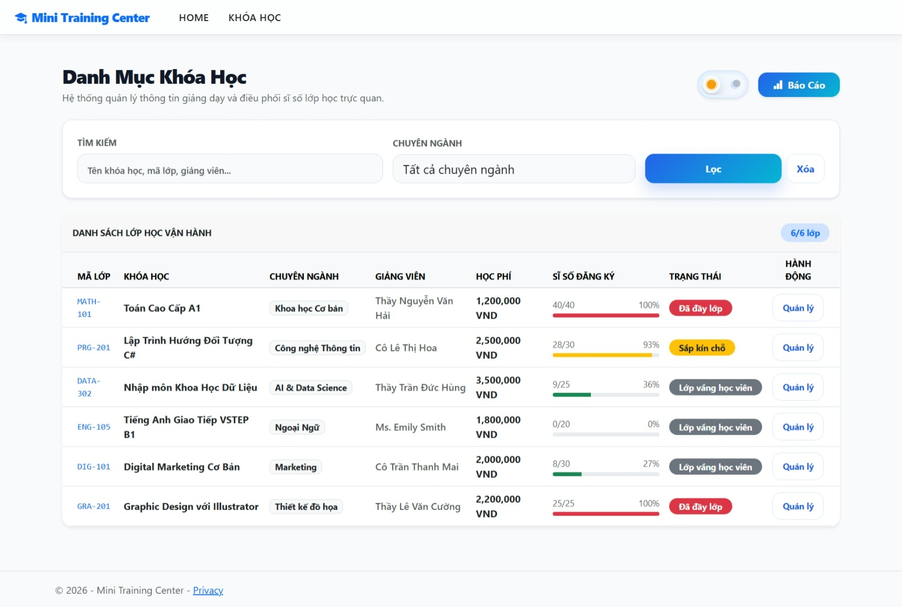
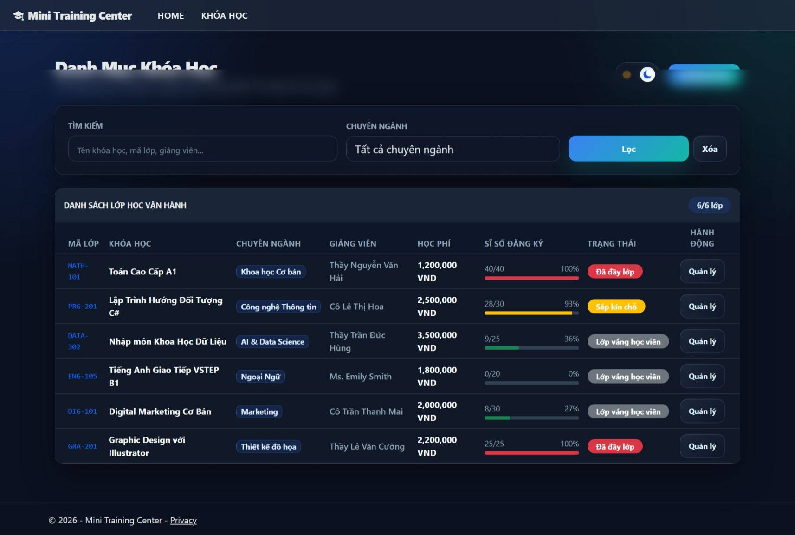
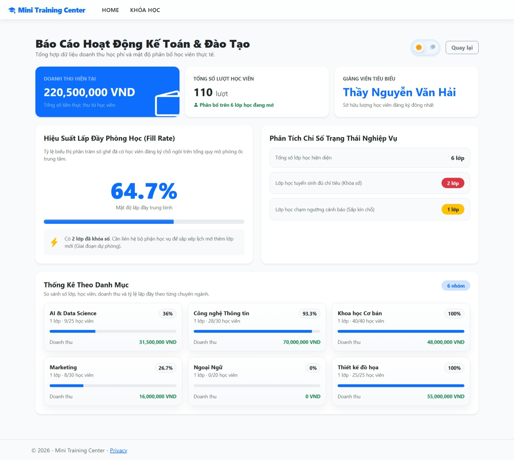
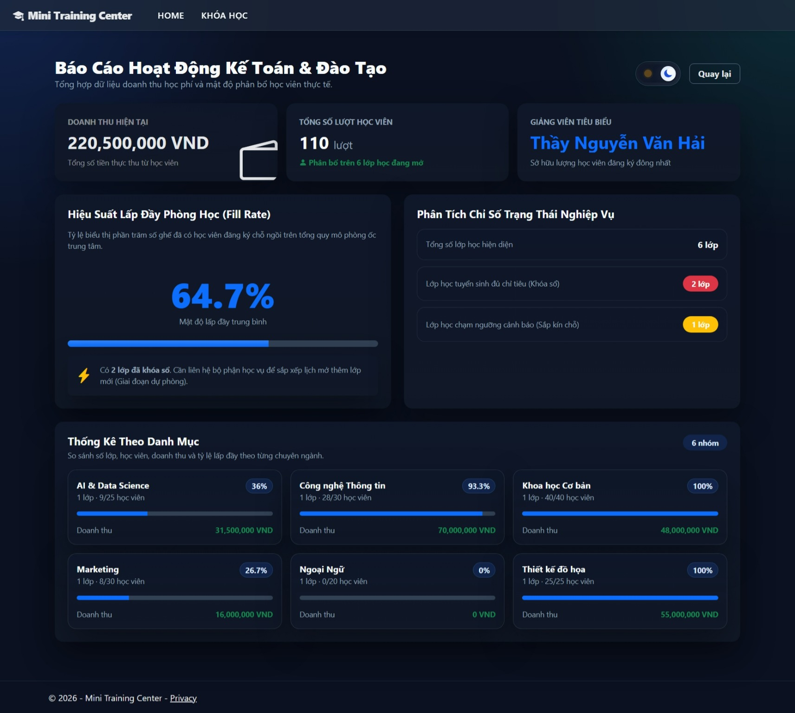

# Mini Training Center Course Catalog MVC

Ứng dụng ASP.NET Core MVC quản lý danh mục khóa học cho một trung tâm đào tạo nhỏ. Project được thực hiện cho Lab02 - MVC Foundations, dựa trên yêu cầu xây dựng lại bài mẫu Product Catalog theo một chủ đề mới có mức độ tương đương.

## Chủ đề

**Mini Training Center Course Catalog MVC**

Hệ thống hỗ trợ xem danh sách khóa học, chi tiết từng lớp, thống kê tổng quan tình hình đào tạo, doanh thu học phí và trạng thái tuyển sinh của các lớp học.

## Công nghệ sử dụng

- ASP.NET Core MVC
- C#
- Razor View Engine
- Bootstrap 5
- HTML, CSS, JavaScript
- LINQ

## Cấu trúc chính

```text
MiniCourseCatalog.Mvc
├── Controllers
│   ├── HomeController.cs
│   └── CoursesController.cs
├── Models
│   └── Course.cs
├── Services
│   └── CourseService.cs
├── ViewModels
│   ├── CourseListItemViewModel.cs
│   ├── CourseDetailViewModel.cs
│   ├── CourseStatsViewModel.cs
│   ├── CourseIndexViewModel.cs
│   └── CategoryStatsViewModel.cs
├── Views
│   ├── Home
│   ├── Courses
│   └── Shared
└── wwwroot
    ├── css
    └── js
```

## Chức năng cơ bản (Yêu cầu Lab02)

- Trang chủ giới thiệu bài toán quản lý khóa học.
- Trang danh sách khóa học tại `/Courses`.
- Trang chi tiết khóa học tại `/Courses/Detail/{id}`.
- Trang thống kê tổng quan tại `/Courses/Stats`.
- Action trả về text bằng `Content()`: `/Courses/Welcome`.
- Action trả về JSON bằng `Json()`: `/Courses/CourseJson`.
- Action chuyển hướng bằng `RedirectToAction()`: `/Courses/GoToList`.
- Action xử lý không tìm thấy dữ liệu bằng `NotFound()`: `/Courses/Detail/999` và `/Courses/Force404`.
- Phân loại trạng thái khóa học theo nghiệp vụ: Đã đầy lớp, Sắp kín chỗ, Lớp vắng học viên, Còn chỗ đăng ký.

---

## Các Tính Năng Mở Rộng (Điểm Cộng)

Ngoài các yêu cầu cơ bản, hệ thống được phát triển thêm các tính năng nâng cao sau:

### 1. Tìm kiếm và lọc khóa học
Trang `/Courses` hỗ trợ:
- Tìm kiếm linh hoạt theo mã khóa học, tên khóa học hoặc tên giảng viên.
- Lọc danh sách theo chuyên ngành đào tạo.
- Kết hợp đồng thời tìm kiếm, lọc và chế độ giao diện sáng/tối trên cùng một URL (VD: `/Courses?keyword=c%23&theme=dark`).

### 2. Thống kê nâng cao
Trang `/Courses/Stats` được mở rộng thêm các chỉ số quản trị:
- Tổng doanh thu hiện tại dự kiến.
- Tổng lượt đăng ký học viên.
- **Giảng viên tiêu biểu** có lượng học viên đăng ký đông nhất.
- **Tỷ lệ lấp đầy (Fill Rate) trung bình** của toàn bộ trung tâm.

### 3. Thống kê theo danh mục chuyên ngành
Hệ thống hiển thị dashboard thống kê chi tiết cho từng nhóm ngành (AI & Data Science, Ngoại Ngữ, Marketing...):
- Tỷ lệ lấp đầy theo từng danh mục (Hiển thị qua Progress Bar).
- Doanh thu mang lại từ từng nhóm ngành.

### 4. Theme Switcher (Sáng/Tối) bằng Controller
Ứng dụng tích hợp chế độ Dark/Light Mode thông qua tham số `theme` trên URL:
- Chuyển đổi trạng thái bằng nút Toggle Switch trực quan.
- Theme được Controller tiếp nhận, truyền sang View qua `ViewData` và đồng bộ vào thẻ `body` tại `_Layout`.
- Giữ nguyên trạng thái Theme khi điều hướng qua lại giữa các trang.

---

## Screenshots (Giao diện thực tế)

### 1. Trang Danh mục khóa học (Course List)
Hỗ trợ tìm kiếm, lọc danh mục và hiển thị tỷ lệ lấp đầy trực quan.

**Chế độ Sáng (Light Mode)**


**Chế độ Tối (Dark Mode)**


### 2. Trang Thống kê Đào tạo (Dashboard)
Hiển thị tổng quan doanh thu, giảng viên tiêu biểu và phân tích dữ liệu theo chuyên ngành.

**Chế độ Sáng (Light Mode)**


**Chế độ Tối (Dark Mode)**


---

## Hướng dẫn chạy Project

Mở terminal tại thư mục project (Nơi chứa file `.csproj`):

```powershell
cd MiniCourseCatalog.Mvc
dotnet run
```
Sau đó mở trình duyệt theo URL được hiển thị trong terminal (ví dụ: `http://localhost:5063`).

## Các URL dùng để kiểm thử (Testing URLs)

```text
/
/Courses
/Courses?theme=dark
/Courses?keyword=c%23
/Courses?category=Marketing
/Courses/Detail/1
/Courses/Detail/999
/Courses/Stats
/Courses/Stats?theme=dark
/Courses/Welcome
/Courses/CourseJson
/Courses/GoToList
/Courses/Force404
/Courses/CategoryInfo
```

## Ghi chú Troubleshooting

- Nếu sau khi sửa đổi mã HTML/CSS mà trình duyệt chưa cập nhật, hãy nhấn `Ctrl + F5` để xóa cache.
- Nếu `dotnet run` báo lỗi file đang bị khóa (file in use), hãy dừng process cũ bằng lệnh:
  ```powershell
  Stop-Process -Name MiniCourseCatalog.Mvc -ErrorAction SilentlyContinue
  dotnet run
  ```